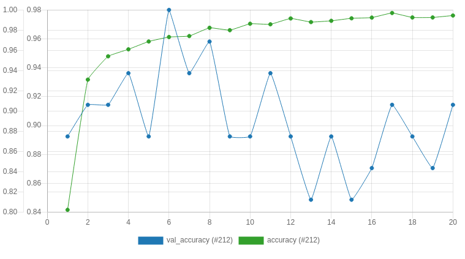
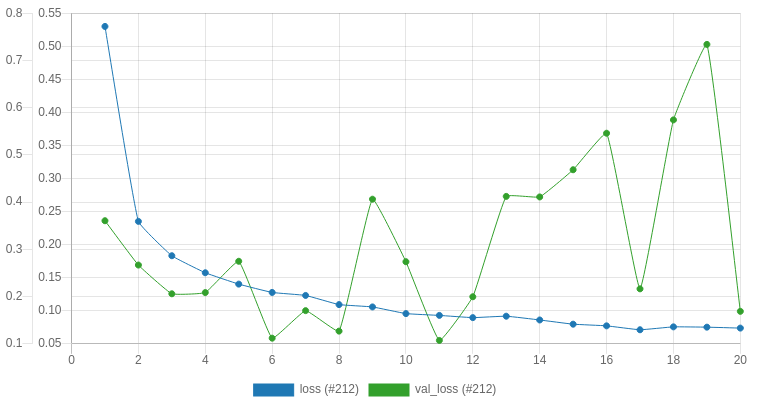
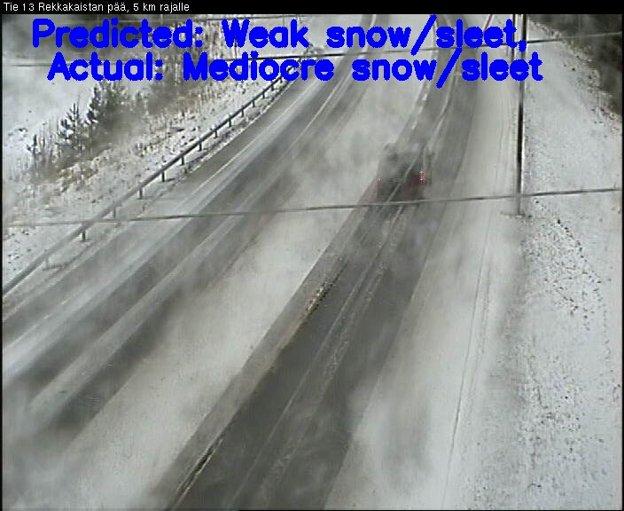
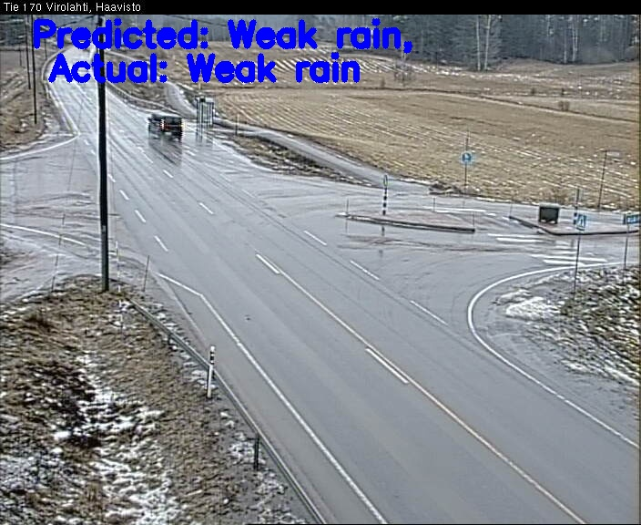
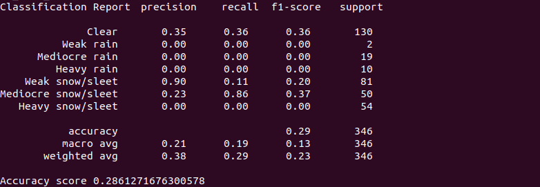

# AM-Traffic-I-Phase-2-Iteration-2-Task1-Tensorflow

Prepare and develop end-to-end pipeline for a weather conditions classification light-weight neural network. 

As an input this model should take a video sequence from CCTV camera; As an output model should classify weather conditions (Clear, Rain, Snow). 

Network should be light enough to run in realtime on a Jetson Nano device.

-------------------------------------------------------------------------------------------------------------------------------

# Data
The data was collected during task4. As described in task4, the images were downloaded in AWS S3 bucket and the labels are included in the images’s names whose format is as follows:<br/>
 *'camera-id'\_r'roadConditionCategory'\_w'weatherConditionCategory'\_'measuredTime'*<br/>
 eg. "C1255201_r7_w0_2020-01-29_21-00-39"<br/>
 The weather conditions to classify are:<br/>
 1. Clear (0)
 2. Raining, three scales:
      * Weak rain (1)
      * Mediocre rain (2)
      * Heavy rain (3)
  3. Snowing, three scales:
      * Weak snow/sleet (4)
      * Mediocre snow/sleet (5)
      * Heavy snow/sleet (6)
      
Unfortunately the labels are not accurate and have many mistakes and that’s due to different reasons such as the quality of the image, the distance between camera and weather station, sensors errors… so manually checking the labels was necessary. Besides, some categories (like mediocre rain) don’t exist in the collected dataset and some others have small amount of images. That’s why extra data from other cctv cameras was fed to the model. The sources of the added data could be found in ‘added_data.txt’ file.
# Training the model (train.py)
Once the data was ready, a model was built with tensorflow. I used the resnet50 architecture pretrained on imagenet dataset. The choice of the architecture was based on the fact that the model must be light weighted in order to be run in realtime on a Jetson Nano device. Therefore, I had to make a compromise between accuracy and lesser number of parameters. Since depth-wise convolutions are known of low accuracy, I didn’t opt for mobilenet. So I found that resnet50 (less layers is not available in Keras) is the best candidate.<br/>  
The data was augmented (horizontal_flip, rotation, width_shift, height_shift) using keras library.<br/>
For the model finetuning grid search was applied to these hyperparameters:
* **learning_rate**: The learning rate of Adam algorithm
* **batch_size**: Training batch size
* **image_size**: Chosen size of image
* **layers_fine_tune**: Layers to be unfrozen and fine tuned

The best validation accuracy I got is **0.97** with training accuracy of **0.97** (execution **#212** in Valohai).<br/>
This model was obtained with learning rate equal to **0.001**, batch size of **64** sample, image with **(224x224)** size and no layer fine tuned.

Plot of train/validation accuracy per epoch.
<p align="center">
  
</p>

Plot of train/validation loss per epoch.
<p align="center">
  
</p>

# Testing the model (predict.py)
To test the performance of the model we run the model on images not included in training and validation datasets.
## Prediction on images
You can predict on images using *predict_images_tf.py* script:
```sh
python3 predict_images_tf.py --predictions weather --model ./models/tensorflow/WeatherCondi.h5 --input ./input --output ./output_weather --labels ./weather_labels.json
```
Where:
* **'predictions'**: weather (conditions to predict).
* **'model'**: the path of the training model.
* **'input'**: the path of your input images.
* **'output'**: the path of the output images.
* **'labels'**: the path of labels json file.
### Results
The predictions are displayed on images as follows:

<p align="center">
  
</p>

<p align="center">
  
</p>

Predictions metrics calculated on the test dataset:

<p align="center">
  
</p>

## Prediction on video
You can predict on video using *predict_video_tf.py* script:
```sh
python3 predict_video_tf.py --predictions weather --model ./models/tensorflow/WeatherCondi.h5 --input ./test_video.mp4 --labels ./weather_labels.json --output ./output/weather_conditions.avi --size 1
```
Where:
* **'predictions'**: weather (conditions to predict).
* **'model'**: the path of the training model.
* **'input'**: the path of your input vdeo (you have to mention the input video name).
* **'output'**: the path of the output video (you have to mention the output video name).
* **'labels'**: the path of labels json file.
* **'size'**: size of queue for averaging (128 by default). Set the size to 1 if you  don't want to perform any averaging.
# Conversion to TensorRT
Conversion of the built Keras model to TensorRT model.
## Requirement
* tensorflow-gp~=1.15.0
* Keras~=2.2.5
* argparse~=1.4.0
## Conversion
Use the script *convert_keras_to_trt.py* as follows:
```sh
python3 convert_keras_to_trt.py --trt_path ./models/keras_trt --model ./models/tensorflow/RoadCondi.h5 --output_node dense_1/Softmax
```
Where:
* ***trt_path**: path where to save the converted models.
* **model**: path to trained serialized keras model.
* **output_node**:  name of the output node (*dense_1/Softmax* in our case).

After running this script successfully, in trt_path you will have:
*checkpoints, tf_model.meta, frozen_model.pb and tensorrt_model.pb.* 
